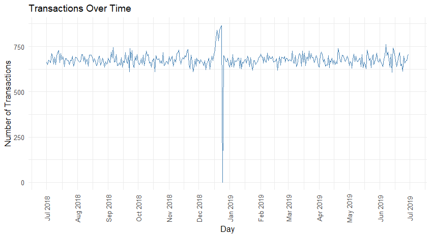
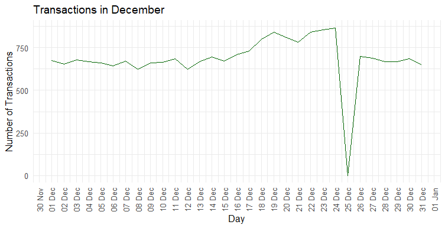
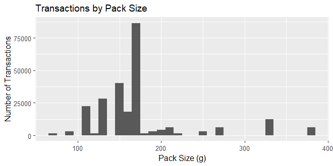
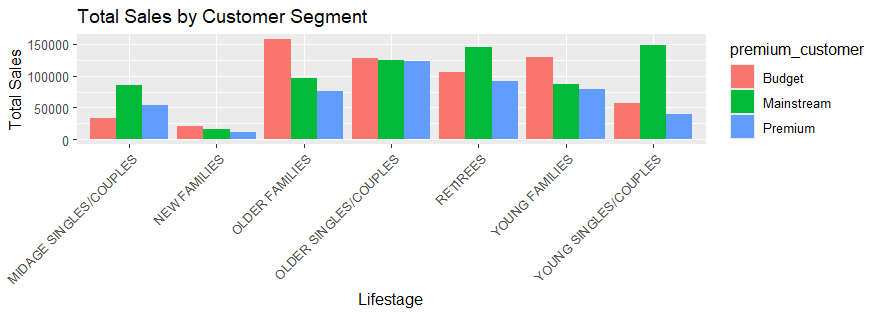
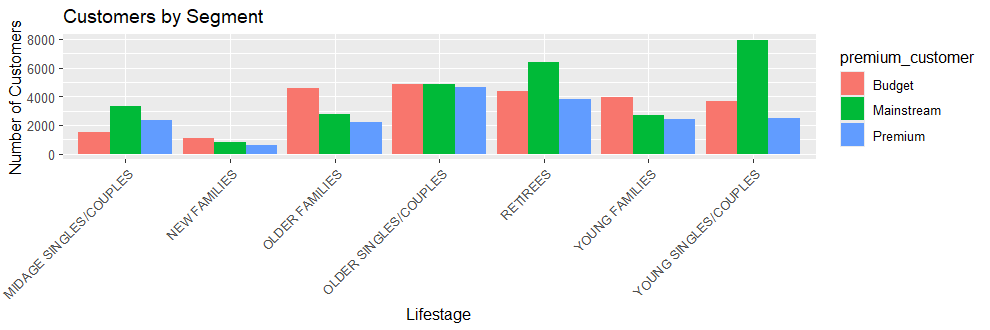
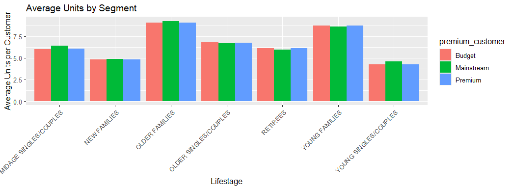
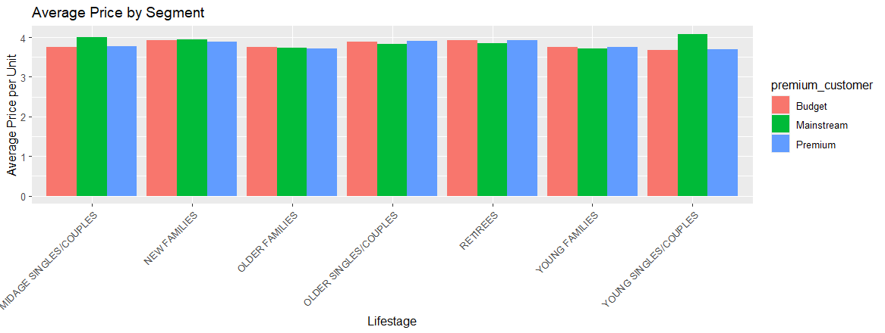
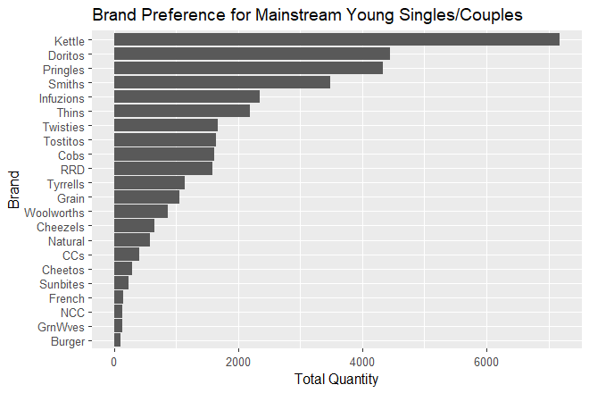
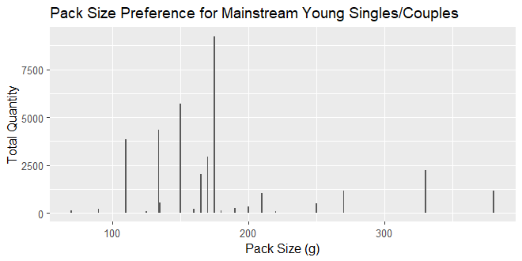

# Quantium Retail Strategy and Analytics

Welcome to my **Data Analytics Project using R**! This repository contains my solution for Task 1 of the Quantium Virtual Internship, where I analyzed retail transaction and customer data to uncover insights into purchasing behaviors using R.

## Project Overview

In this project, I:
- Loaded and cleaned transaction data (`QVI_transaction_data.xlsx`) and customer data (`QVI_purchase_behaviour.csv`).
- Conducted exploratory data analysis to identify transaction trends and product preferences.
- Analyzed customer segments to derive actionable insights, with a focus on Mainstream Young Singles/Couples.

### Key Findings
- **Transaction Trends**: Consistent daily transactions with a notable dip on Christmas Day (Dec 25, 2018).
- **Pack Sizes**: 175g packs are the most popular, reflecting a preference for mid-sized options.
- **Customer Segments**: Mainstream Young Singles/Couples and Budget Older Families drive significant sales.
- **Brand Preferences**: Kettle, Doritos, and Pringles dominate among Mainstream Young Singles/Couples.

## Repository Structure

- **data/**: Raw datasets (`QVI_transaction_data.xlsx`, `QVI_purchase_behaviour.csv`) and Processed data (`QVI_data.csv`).
- **scripts/**: R Markdown script (`Quantium_Task1_Solution.Rmd`) containing the analysis.
- **visualizations/**: Exported PNG files of key plots (e.g., `TransactionOverTime.png`, `BrandPreferenceForMainstreamYoungSinglesCouples.png`).
- **documentation/**: Final PDF report (`FinalReport.pdf`) generated from the Rmd file.
- **README.md**: This file, providing an overview and instructions.
- **REPLICATION.md**: Detailed guide to replicate the analysis.

## Installation

To run this project, you’ll need:
- **R** (version 4.0 or later) and **RStudio**.
- **R Packages**: `data.table`, `ggplot2`, `ggmosaic`, `readr`, `readxl`, `janitor`, `dplyr`, `lubridate`, `knitr`.
- **LaTeX**: TinyTeX for knitting the Rmd to PDF.

Install the R packages:
```R
install.packages(c("data.table", "ggplot2", "ggmosaic", "readr", "readxl", "janitor", "dplyr", "lubridate", "knitr"))
```

Install TinyTeX:
```R
install.packages("tinytex")
tinytex::install_tinytex()
```

## Usage

1. Clone this repository:
   ```bash
   git clone https://github.com/yourusername/Quantium_Retail_Strategy_and_Analytics.git
   ```
2. Open `scripts/Quantium_Task1_Solution.Rmd` in RStudio.
3. Adjust the `filePath` variable in the script to point to your `data/` folder.
4. Knit the Rmd file to generate `reports/FinalReport.pdf`.
5. Explore the visualizations in the `visualizations/` folder.

See [REPLICATION.md](REPLICATION.md) for detailed steps.

## Visualizations

Key visualizations (stored in `visualizations/`):
- : Daily transaction trends, showing a Christmas Day dip.
- : Zoomed-in view of December transactions.
- : Histogram of transactions by pack size.
- : Sales distribution across customer segments.
- : Number of customers per segment.
- : Average units purchased per segment.
- : Average price per unit per segment.
- : Top brands for Mainstream Young Singles/Couples.
- : Preferred pack sizes for Mainstream Young Singles/Couples.

These are embedded in the `FinalReport.pdf` and available as standalone PNGs.

## Blog Post

For a detailed walkthrough, read my [Medium blog post](https://medium.com/@davidsingh.blogs).


## Contact

Connect with me on [LinkedIn](https://www.linkedin.com/in/david-singh-96830324a/) or [GITHub](https://github.com/d-s007) for questions or collaboration!

---

If you find this project useful, please consider starring the repository! 🌟