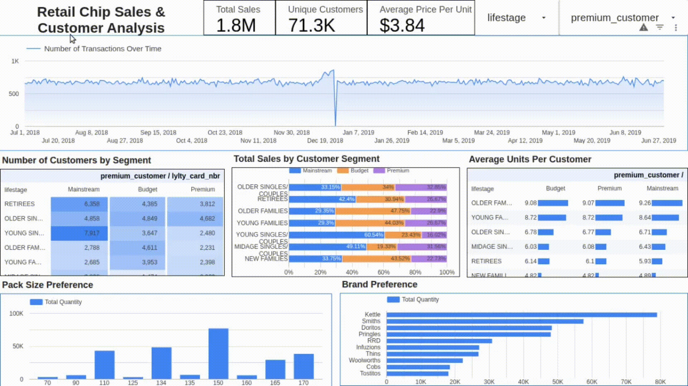

# 📊 Retail Chip Sales & Customer Analysis in FMCG using R + Looker

---

## 🚀 Executive Summary

* **Business Problem:** A leading retailer in the FMCG sector wanted to understand **customer purchasing patterns in the chips category** to improve marketing effectiveness and optimize product strategy.
* **Solution:** Conducted an **end-to-end retail analytics project**—from data cleaning and transformation to exploratory analysis and customer segmentation, culminating in an interactive `Looker` dashboard.
* **Key Results:**

  * Analyzed **264K+ transactions** across **71K unique customers** with **\$1.8M in total sales**.
  * Identified **Mainstream Young Singles/Couples** as the most valuable segment—higher spending per unit and preference for premium brands like *Kettle* and *Doritos*.
  * Found **175g packs** dominate sales, suggesting optimal pack size for promotions.
* **Tools & Skills Used:** R | dplyr | ggplot2 | Looker | Data Cleaning | Cohort & Segment Analysis | Hypothesis Testing

---

## 🏢 Project Background

* The FMCG industry is **highly competitive** with thin margins, making **customer insights** a critical differentiator.
* Chips are a **high-volume, high-frequency purchase** product. Retailers need to know **who buys them, what drives volume, and how pricing impacts sales.**
* This project analyzed **transactional sales and customer demographic data** to derive **actionable segment-level insights**.
* Supporting assets:

  * [📂 Full Report](https://d-s007.github.io/Quantium_Retail_Strategy_and_Analytics/)
  * 
---

## 📊 Key Visualizations

* 
  *Daily transactions: steady sales, clear dip on Christmas Day (store closures).*

* 
  *Zoomed-in December view showing pre-Christmas sales spike.*

* 
  *175g dominates → optimal pack size for promotions.*

* 
  *Mainstream Young Singles/Couples and Retirees drive the highest sales.*

* 
  *Customer base skewed toward Young Singles and Retirees.*

* 
  *Premium brands dominate among Mainstream Young Singles/Couples.*

* 
  *175g packs most popular with target segment.*

---

## 🗂️ Data Structure & Initial Checks

* **Transaction Data** – 264,836 rows × 8 columns (date, store, product, sales).
* **Customer Data** – 72K records (lifestage, premium/budget/mainstream).
* Key steps:

  * Converted Excel integer dates to standard `Date` format.
  * Standardized product names, extracted **pack size** and **brand**.
  * Removed **non-chip products** (e.g., salsa) and **commercial outliers** (200-unit purchases).
* Ensured clean join with no missing customer attributes.

---

## 🔎 Methodology & Approach

1. **Data Cleaning & Transformation** – date conversion, text parsing, outlier removal.
2. **EDA** – sales distribution, product mix, transaction frequency.
3. **Feature Engineering** – pack size, brand categorization.
4. **Segmentation Analysis** – by **lifestage** and **premium/budget status**.
5. **Statistical Testing** – validated differences in price sensitivity across groups.
6. **Visualization** – built Looker dashboard with KPIs, time trends, pack size and Brand preferences.

---

## 📊 Insights Deep Dive

### 🧑‍🤝‍🧑 Customer Segments

* **Mainstream Young Singles/Couples** – **largest customer base** (7.9K), contribute disproportionately to sales.
* **Retirees & Older Families** – strong sales drivers, high unit volumes per customer.

### 💰 Sales & Pricing

* **Average Price/Unit:** \$3.84.
* **Mainstream Singles/Couples pay more per unit** (avg. \$4.04 vs. \$3.70, p < 0.001).
* Suggests **lower price elasticity** in this group → opportunity for premium upselling.

### 📦 Pack Size Preference

* 175g packs dominate sales (66K+ transactions).
* Mid-size packs are optimal for both **individual and group consumption.**

### 🏷️ Brand Preference

* Top 3 brands: **Kettle, Doritos, Pringles**.
* Indicates **brand equity is concentrated**, with niche brands playing minor roles.

---

## 📈 Results & Business Recommendations

* **Result 1:** Mainstream Young Singles/Couples are the **highest-value segment**.

  * 📌 **Recommendation:** Target digital campaigns with *premium pack bundles* and *new flavor launches*.

* **Result 2:** Retirees and Older Families buy **higher units per transaction**.

  * 📌 **Recommendation:** Push **value packs and family-size offers**.

* **Result 3:** 175g packs dominate demand.

  * 📌 **Recommendation:** Ensure **stock priority for 175g SKUs** and consider **limited editions** in this size.

* **Result 4:** Kettle & Doritos are brand leaders.

  * 📌 **Recommendation:** Partner with these brands for **co-branded promotions**.

---

## ⚠️ Assumptions & Caveats

* Data excludes **non-chip products** after filtering.
* Christmas Day (Dec 25, 2018) missing transactions—likely store closures.
* Outlier removal (200-unit bulk purchases) assumes **non-retail customer behavior**.

---

## 🔮 Next Steps & Future Work

* Expand analysis to **cross-category purchases** (soft drinks, dips) for basket insights.
* Build **predictive models** for demand forecasting and price elasticity.
* Test **A/B promotions** by segment (e.g., premium ads for young singles).
* Incorporate **geospatial store-level data** to optimize distribution.

---

## 🛠️ Tools & Skills Demonstrated

* **R:** Data.table, dplyr, ggplot2, janitor, lubridate
* **SQL:** Joins, aggregations (for data prep, if scaled to DB)
* **Visualization:** Tableau dashboard for stakeholders
* **Statistics:** T-tests, cohort/segment analysis
* **Business Translation:** Retail strategy alignment with customer insights

---

## 📂 Repository Structure

```
Quantium_Retail_Analytics/
│
├── data/
│   ├── raw/                # Original files (QVI_transaction_data.xlsx, QVI_purchase_behaviour.csv)
│   ├── processed/          # Cleaned data (QVI_data.csv, feature-engineered files)
│
├── scripts/
│   ├── FinalScript.Rmd                 # Complete code in R
│
├── visualizations/
│   ├── TransactionOverTime.png
│   ├── TransactionsInDecember.png
│   ├── TransactionsByPackSize.png
│   ├── TotalSalesByCustomerSegment.png
│   ├── CustomersBySegment.png
│   ├── BrandPreferenceForMainstreamYoungSinglesCouples.png
│   ├── PackSizePreferenceForMainstreamYoungSinglesCouples.png
│   └── Looker_Dashboard.png
|   
│
├── dashboards/
│   ├── Looker_Dashboard.gif          # Looker dashboard 
│   └── links.md                     # Public Looker link + notes
│
├── docs/                              # All Documentation
│   ├── FinalReport.pdf                # Detailed report in pdf format
│   └── index.html                     # HTML based github pages deployed report
│
├── README.md                        # Detailed README
└── REPLICATION.md                   # All R packages needed and setup guide
```

---

## 📜 References & Sources

* Quantium Virtual Internship Dataset – Retail Strategy & Analytics
* Project Repository: [Github Repo](https://github.com/D-S007/Quantium_Retail_Strategy_and_Analytics)